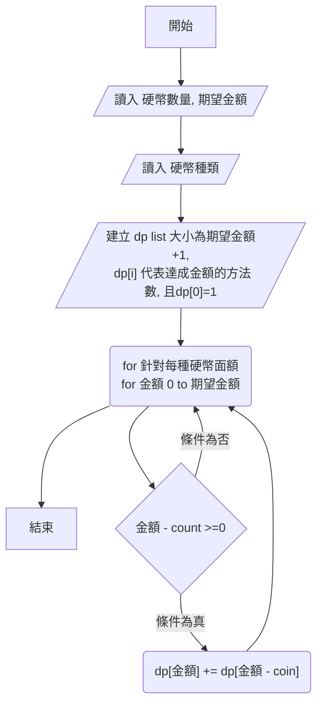

# 1118

Problem O



```
flowchart TD;
 A[開始] -->B[/讀入 硬幣數量, 期望金額 /]
 B --> C[/讀入 硬幣種類/]
 C --> D[/"建立 dp list 大小為期望金額+1,<br> dp[i] 代表達成金額的方法數, 且dp[0]=1"/]
 D --> E("for 針對每種硬幣面額 <br> for 金額 0 to 期望金額")
 E --> 結束
 F --> |條件為真| H("dp[金額] +=  dp[金額 - coin]")
 E --> F{金額 - count >=0}
 F -->  |條件為否| E
 H --> E
```

```
# Problem O 硬幣 v1.T
# n,amount=map(int,input().split())
# coins=list(map(int,input().split()))
n,amount=3,9  # 硬幣數量,期望金額
coins=[2,3,5]
dp=[1]+[0]*amount # 建立0到期望金額的列表 代表金額達到的組合數
for coin in coins: # 取出 每個硬幣
    for start in range(1,amount+1): #
        if start>=coin:
            dp[start]+=dp[start-coin] # 達到金額的次數

print(dp[-1]) # 達到期望金額的組合數

#Input
#3 9
#2 3 5
#Output
#3

#Input
#3 10
#2 3 5
#Output
#4

```
