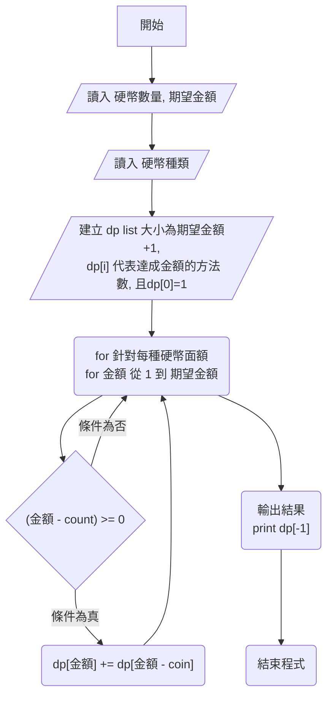

# 1118

### list[(v,k), (v,k), ...] 需求：依照 v升冪+k降冪排序, by TPCU C.C. Lin
```
d = {65:5, 66:5, 67:3, 68:5, 69:3, 70:1}
t = [(v,k) for k,v in d.items()] # 利用 dict.items() 將 key, value 互換
# 排序前 t 為 [(5, 65), (5, 66), (3, 67), (5, 68), (3, 69), (1, 70)]
t = sorted(t) # 利用 sorted 先排序，但 v,k 都是升冪排序，無法符合需求
# 排序後 t 為 [(1, 70), (3, 69), (3, 67), (5, 68), (5, 66), (5, 65)]
i,ans=0,[]
while len(t) > 0:
    if i+1 <=len(t)-1 and t[i][0] == t[i+1][0]: 
        i += 1 # t[i][0] == t[i+1][0] 與後一個的內容相同, 重複次數+1
    else:
        while True:
            ans.append(t[i])
            t.pop(i) # 將 t[i] 之內容移除
            if i > 0:
                i -= 1 # 遞減重複次數，直到 0
            else:
                break
ans = [(v,k) for k,v in ans] # 利用 dict.items() 將 key, value 互換
print(ans) # [(70, 1), (69, 3), (67, 3), (68, 5), (66, 5), (65, 5)]
```

### list[(k,v), (k,v), ...] 需求：依照 k升冪+v降冪排序, by TPCU C.C. Lin
```
d = {65:5, 66:5, 67:3, 68:5,69:3,70:1}
t = [(k,v) for k,v in d.items()]
ans = sorted(t, key=lambda x:(x[1],-x[0])) # 使用 lambda 匿名函數
print(ans) # [(70, 1), (69, 3), (67, 3), (68, 5), (66, 5), (65, 5)]
```

### list[(v,k), (v,k), ...] 需求：依照 v升冪+k降冪排序, by TPCU C.C. Lin
```
d = {65:5, 66:5, 67:3, 68:5,69:3,70:1}
t = [(v,k) for k,v in d.items()]
ans = sorted(t, key=lambda x:(x[0],-x[1])) # 使用 lambda 匿名函數
print(ans) # [(1, 70), (3, 69), (3, 67), (5, 68), (5, 66), (5, 65)]
```

## Problem O 硬幣 



```
flowchart TD;
 A[開始] -->B[/讀入 硬幣數量, 期望金額 /]
 B --> C[/讀入 硬幣種類/]
 C --> D[/"建立 dp list 大小為期望金額+1,<br> dp[i] 代表達成金額的方法數, 且dp[0]=1"/]
 D --> E("for 針對每種硬幣面額 <br> for 金額 從 1 到 期望金額")
 E --> 結束
 F --> |條件為真| H("dp[金額] +=  dp[金額 - coin]")
 E --> F{"(金額 - count) >= 0"}
 F -->  |條件為否| E
 H --> E
```

```
# Problem O 硬幣 v1.T
# n,amount=map(int,input().split())
# coins=list(map(int,input().split()))
n,amount=3,9  # 硬幣數量,期望金額
coins=[2,3,5]
dp=[1]+[0]*amount # 建立0到期望金額的列表 代表金額達到的組合數
for coin in coins: # 取出 每個硬幣
    for m in range(1,amount+1): #
        if m>=coin:
            dp[m]+=dp[m-coin] # 達到金額的次數

print(dp[-1]) # 達到期望金額的組合數

#Input
#3 9
#2 3 5
#Output
#3

#Input
#3 10
#2 3 5
#Output
#4

```

## Problem N 進步獎

```
# Problem N 進步獎 v1.a
# 今年資訊月第5題剛好是一樣的題目
n=int(input())
s=list(map(int,input().split()))
dp=[1]*n
for i in range(1,n):
    for j in range(i):
        if s[i]>s[j]:
            dp[i]=max(dp[i],dp[j]+1) # 這裡的 dp[i] 代表的是以 i 為結尾的最長遞增子序列
print(max(dp))

#Input
#11
#20 40 32 67 40 20 89 300 404 13 13
#Output
#6

```
